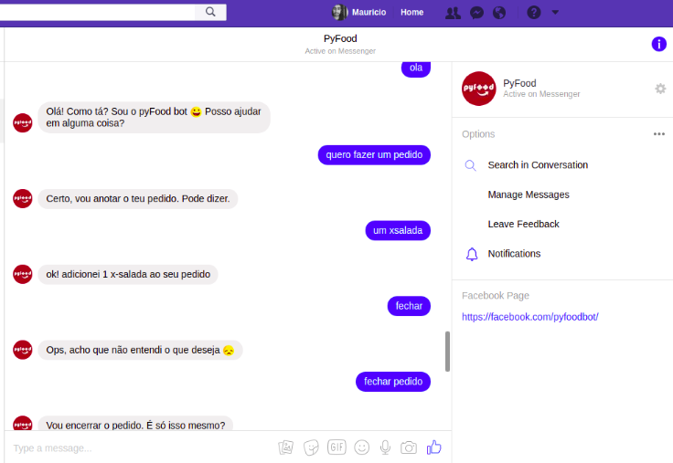
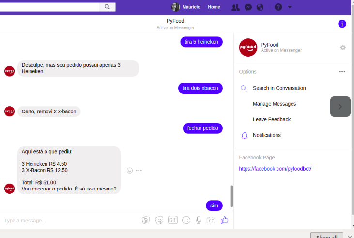
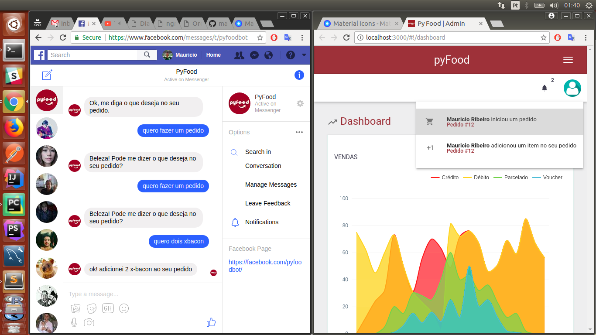
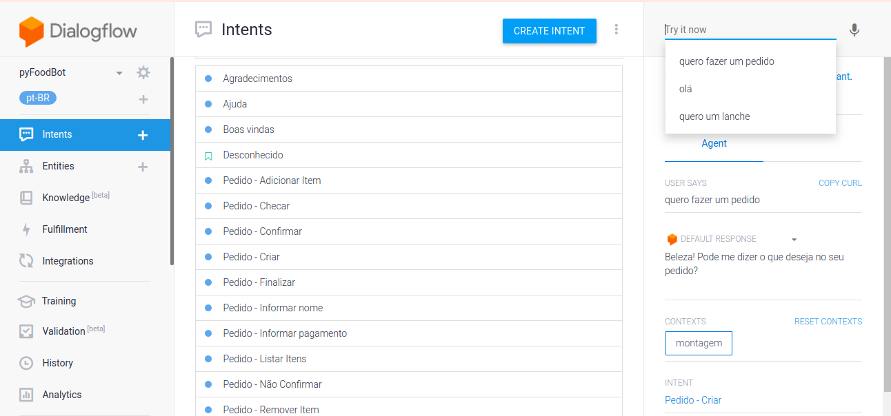
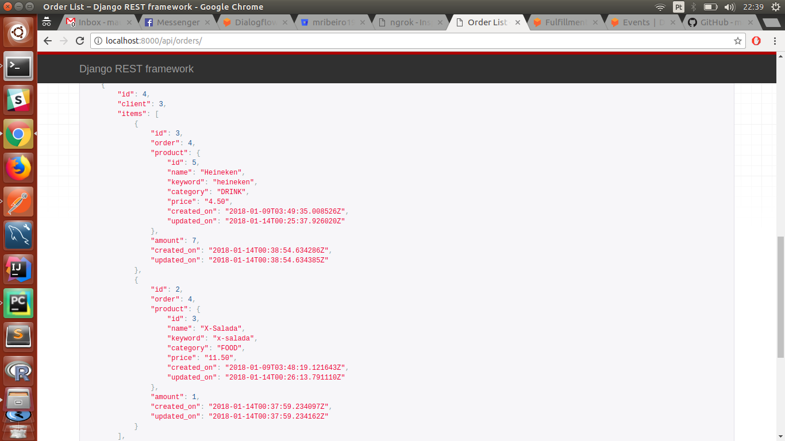

# pyfood
pyFood is a Django web application connected with chatbot (via Dialogflow)

### Tecnologias utilizadas

#### Back-End:
 - Python 3.4
 - Django
 - RESTFul API
 - Dialogflow

##### Front-End
 - AngularJS
 - Material Design
 - Npm e Bower 
### Acesso
 - username: admin
 - email: admin@pyfood.com
 - pass: fatec2018

### Demo: 

- Video: https://youtu.be/lgfy4yMmAs4

### Prints:

- Conversa com o bot via Facebook

- Adicionando e removendo pedidos

- Notificação no aplicativo web em tempo real (com ingredientes e detalhes):

- Contextos de conversa pelo Dialogflow

- API disponibilizando pedidos

